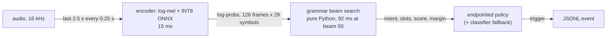

# The grammar beam search: how it works and why it is slow

**BLUF.** The grammar-constrained CTC prefix beam search used to be pure Python and was **86% of encoder + beam-search time at the shipped beam of 50** (92 ms of a 107 ms window on the server). It is now an
**exact (bit-identical) numba kernel: 0.92 ms per window, 100x faster, 6% of encoder + search**, with an exact plain-Python fallback at 5.6x. Nothing about the output changed: the same prefixes, in the same order, with the same
floats, on all 470 soak windows, so accuracy and the incomplete-prefix rejection are untouched and the beam stays at 50. Sections 1-4 describe the *original* search and why it was slow; section 6 records what was done.
The Pi has not been re-measured since (open item 1), and its earlier 3.21 real-time factor was taken with 4 workers on 4 cores, so it may overstate the search cost.

Measured 2026-10-03 on the server CPU (one thread), INT8 ONNX wide CTC, `optionb` grammar. Reproduce the encoder/beam numbers with `scripts/profile_beam_search.py`;
the soak numbers are in `soak/holdout-wake-gap-v1/results/` (`rpi4.md`, `tuned-cpu-onnx-int8-hybrid.md`, `beam{10,15,25}.md`).

## 1. Where it sits

`vcm/streaming/runner.py` (`_evaluate_window`) re-encodes the **whole 2.5 s window** every stride and decodes it from scratch, only while a wake-word period is open. Nothing is
carried from one window to the next, so each audio frame is encoded and searched in about ten consecutive windows. `decode_ms` in the soak output is this encoder + beam search +
policy (the classifier only runs on the windows where the fallback applies); `gate_ms` is the wake word.

## 2. The algorithm

The grammar (`common/grammar_core.py`, compiled for `optionb` by `vcm/optionb/grammar.py`) is a **character trie**: 1,447 nodes for the 93 wordings, where a node's children are the
characters that may come next and a terminal node carries `(intent, slots)`. `vcm/decoder.py:prefix_beam_search` runs the standard CTC prefix beam search over the encoder's
log-probabilities `logp` (T frames x 29 symbols: blank + 28 characters), restricted to that trie:

- A hypothesis is a prefix string with two log-masses: `pb` (alignments ending in blank) and `pnb` (ending in a character), and its trie node.
- For every frame and every live hypothesis it makes up to three moves: stay on the same prefix by emitting blank, stay by repeating the last character, or extend to a trie child
  character. An extension the trie does not allow is dropped on the spot, so the search is grammar-valid by construction.
- Hypotheses reaching the same prefix are merged with a log-sum-exp. After each frame the hypotheses are sorted by total mass and cut to the `beam_width` best.

`decode_utterance` then takes the final beam, keeps the terminal prefixes, picks the best by `mass / T`, and applies the acceptance logic: no completed terminal means no match; the
**incomplete-prefix margin gate** (`--required-command-margin 4.0`, `docs/INCOMPLETE-GRAMMAR-REJECTION.md`) compares the best completed command with the strongest designated
incomplete prefix in the same beam; then the confidence threshold (`-0.1`). Rejection quality therefore depends on the incomplete prefixes surviving in the beam, which is why the
beam width is also an accuracy parameter and not only a speed one.

## 3. What a window costs (server, one thread)

470 windows of 2.5 s (T = 126 frames, 20 ms each) over the first 120 s of the soak audio:

| Stage | Per window | Share of encoder + beam search |
|---|---:|---:|
| Encoder: log-mel features + INT8 ONNX + log-softmax | 15.0 ms | 14% at beam 50, 43% at beam 10 |
| Beam search, beam 50 (shipped) | 91.9 ms | 86% |
| Beam search, beam 25 | 48.9 ms | 76% |
| Beam search, beam 10 | 20.2 ms | 57% |

The same runs through the profiler (`cProfile`, which inflates pure-Python time, so read it as a share): at beam 50 `prefix_beam_search` is 78% of `_evaluate_window`'s time; at beam 10, 45%.
The windows here include silence outside any wake-word period; the soak decodes only windows inside a period, which is why its mean decode time at beam 50 is 70 ms, not 92 ms.

Two older figures in the repo describe a different configuration and should not be quoted for the shipped one: a former `runner.py` docstring ("~97% beam search / ~3% ONNX forward, T=251
beam=25", since corrected) and ticket 04's "about 60%". At the shipped settings (T = 126, beam 50) the measured share is about 86% (encoder + beam search only). The earlier fp32 measurement in
`AI231-FIL50.md` (encoder 19 ms, beam 41 ms, 68%) is consistent with this picture.

## 4. Why it is inefficient

Each point is observed in `decoder.py` or measured with `scripts/profile_beam_search.py`.

1. **The beam is pruned by count, never by probability.** At beam 50 there are 49.3 live hypotheses per frame on average and the beam is full on **98% of frames**, yet **89.5% of frames
   have P(blank) > 0.99 and 86.2% have > 0.999**. On those frames nearly all the mass is on "stay on the current prefix", and the other ~49 hypotheses are noise extensions with
   negligible mass that are still extended, merged and sorted every frame.
2. **The inner loop walks the whole alphabet, the grammar allows one character.** For every hypothesis and frame it loops over all 28 non-blank characters (`for char_id, ch in
   ID_TO_CHAR.items()`), but the trie has **1.00 children per node on average** (max 15; the mean is over all 1,447 nodes, not only the ones the search visits). That is about **174,000 inner-loop iterations per window**
   at beam 50, and for a typical hypothesis only about one of the 28 can extend, so most iterations end at `children.get(ch) is None`.
3. **A numpy scalar is converted before the check that makes it unnecessary.** `logp_c = float(logp_t[char_id])` runs for every character before the trie lookup that discards most of them.
   Indexing a numpy array for a Python float is slow, so those wasted conversions are probably a large part of the loop (not isolated by a separate measurement here).
4. **Heavy bookkeeping per hypothesis.** The profile at beam 50 over 119 windows shows 1.68 M `_add` calls (about 14,000 per window), 4.58 M `_logsumexp` calls (`math.exp` + `math.log`, about 38,000 per
   window) and 14.9 M `dict.get` calls. `_add` is a closure re-created every frame, prefixes are concatenated strings used as dict keys, and every hypothesis is a dataclass instance.
5. **The pruning sort is expensive.** When the next beam exceeds `beam_width`, `sorted(next_beams.items(), key=lambda kv: kv[1].total())` calls `total()` (another log-sum-exp) once per
   candidate, every frame, to keep the top 50.
6. **Work is repeated across windows.** The stride is 0.25 s and the window is 2.5 s, so about 90% of each window was already encoded and searched in the previous one; nothing is
   cached or carried over.
7. **The only knob is the beam width, and it is shared with rejection quality** (section 2), so it cannot be turned freely.

On the Pi these costs are paid at about six times the server's speed (decode 443 / 764 / 1,575 ms mean / p95 / max against 70 / 126 / 184 ms on the server), most likely because the loop is interpreted
Python on a Cortex-A72 core, whose single-thread speed sets the ratio for a pure-Python hot loop; `--threads 4` cannot help the search because it is single-threaded.

## 5. What lowering the beam width buys (measured, original search)

Same soak (186 commands + 16 out-of-scope clips, 32.6 min), server CPU, one thread, the tuned settings, only `--beam-width` changed:

| Beam | Correct first trigger | Wrong-action | OOS false accepts | Latency after speech end p95 | Decode mean / p95 | RTF p95 |
|---:|---:|---:|---:|---:|---:|---:|
| 50 (shipped) | 151/186 | 9 | 3/16 | 0.65 s | 70 / 126 ms | 0.53 |
| 25 | 151 | 9 | 3 | 0.654 s | 45 / 83 ms | 0.36 |
| 15 | 152 | 8 | 3 | 0.654 s | 34 / 71 ms | 0.31 |
| 10 | 151 | 9 | 3 | 0.661 s | 28 / 65 ms | 0.29 |

Accuracy and rejection are unchanged within one command down to beam 10 on this soak (one real speaker; it is a check, not a proof for other speakers). The curve is roughly linear,
about 1-1.5 ms of p95 per beam of width. Extrapolated to beam 0 that leaves a floor of roughly 50 ms of p95 that no beam width removes. The encoder is about 15 ms of it; the rest (policy, the classifier on the fallback windows, other per-window overhead) is not separated here.

**Budget on the Pi (original search; superseded by section 6, and the 6x ratio is suspect, see section 7).** The RTF is the p95 of gate + decode over the 250 ms stride. On the Pi that is 41.75 + 764 = 806 ms (3.21 x 250 ms); on the server it is about 126 ms plus a few ms of gate. The ratio is about 6, so the
server-equivalent budget is roughly **40 ms p95 for gate + decode, about 35 ms for decode**. Beam 10 is 65 ms p95: scaling by the same ratio gives about 400 ms of decode plus 42 ms of gate on the Pi, an RTF of about 1.8
(**a projection, not measured on the Pi**). So the beam width alone does not get there; the search itself has to get cheaper.

## 6. What was done (exact changes only)

Implemented in `vcm/decoder.py` (+ `vcm/_beam_numba.py`); `scripts/profile_beam_search.py` reproduces the table. Server, one thread, 470 windows, T = 126, grammar `optionb`:

| Beam | Original loop | Exact plain Python | Exact numba | Output |
|---:|---:|---:|---:|---|
| 50 (shipped) | 92.2 ms | 16.6 ms (5.6x) | **0.92 ms (100x)** | identical on 470/470 windows |
| 25 | 48.3 ms | 9.3 ms (5.2x) | 0.50 ms (96x) | identical |
| 10 | 19.9 ms | 4.3 ms (4.6x) | 0.24 ms (84x) | identical |

"Identical" is checked on every prefix, its order, and the hex of `pb` and `pnb`, not within a tolerance. What changed and why it stays exact:

- The trie is compiled once per grammar (cached by the root object) to integer node ids with per-node child lists, so a hypothesis visits its 1.0 average children instead of 28 characters (points 2-3 of section 4).
- One `tolist()` per frame, no per-frame closure, and the cut sorts on totals computed once (points 4-5).
- The numba kernel is the same loop over arrays (float64, no fastmath, no parallel). Floats are added in the original order, children in ascending character id, and the cut is a stable descending sort, so ties resolve as before.
- The compiled trie drops the 57 digit edges (`alarm 6 am`): the CTC alphabet is `a-z`, space and `'`, so they were never reachable by the search, and the spelled-out wordings (`alarm six am`) carry the same intents. `Grammar.accepts` still uses them.
- Anything the fast path cannot match exactly goes to the original loop: NaN or +inf input, a `beam_width` that is not an integer or is below 1, fewer than 29 columns, or a trie that is not a tree.
- `ME2_BEAM_BACKEND=auto|numba|python|reference` selects the backend (default `auto`: numba if it imports, else plain Python). The streaming CLI runs one tiny search at start-up so the JIT compile
  (about 4 s on the server, not measured on the Pi) is not paid inside the first window, and prints `beam search: backend=... warm-up=... ms` to stderr.

Check through the real CLI (`python -m me2_voicegen.vcm.streaming`, 60 s of the soak audio, 240 windows, beam 50, `--required-command-margin 4.0`): stdout is byte-identical for `reference`, `python` and `numba`, and the whole run
takes 30.8 s with the original search, 11.5 s with the plain-Python path, 12.3 s with numba (3.8 s of that is the one-off JIT warm-up).

**Not done, on purpose.** These were the other options considered; with the search at about 1 ms none is worth its cost:

| Change | Why not |
|---|---|
| Prune by probability (adaptive beam) | Approximate; interacts with the rejection margin, which reads the incomplete prefixes in the beam. |
| Lower `--beam-width` to 10-15 | Was measured to cost nothing on the soak (section 5), but the beam is also an accuracy parameter and beam 50 is now cheap. |
| Larger stride (`--stride-s 0.5`) | Adds about 0.125 s mean latency for no remaining reason. |
| Skip or merge near-blank frames | Changes repeated-character handling ("zero zero", "oo"). |
| Ticket 04 (classifier top-k restricts the grammar) | Recall risk: the xl head's top 3 holds the true intent on only 93.5% of holdout clips. Revisit only if the Pi still misses its budget. |
| Carry encoder/search state between windows | Not exact: during a wake-word period the window grows from its start and the encoder sees the whole window at once. |

**Not a lever:** `--threads`. The ONNX encoder is the only multi-threaded part; it may still help the encoder on the Pi, which is worth one run.

## 7. Open items

1. **Re-measure the Pi** with the new search: `pytest tests/test_vcm_decoder_fast_beam.py` on the Pi first (bit-identity on aarch64), then the soak with `--workers 1` at beam 50, once with `ME2_BEAM_BACKEND=reference` and once with `auto`.
   Check that numba installs from `requirements-pi.txt` and note the JIT warm-up time. The earlier `rpi4.md` ran `--workers 4` on a 4-core Pi, so its 6x "slower than the server" ratio (and the 35 ms decode budget derived from
   it in section 5) is suspect. Server estimate for the new window: encoder 15 ms + search about 1 ms, against a 250 ms stride.
2. If the encoder becomes the Pi's bottleneck, `--threads` and the classifier-fallback windows' extra ONNX call are the next things to profile; their share of the p95 tail is not separated here.
3. The numba compile is not cached on disk (`cache=False`): about 3.8 s at every streaming start and in each CLI test that starts a subprocess. `cache=True` would remove it after the first run, at the cost of a cache directory.
