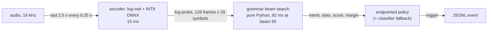

# The grammar beam search: how it works and why it is slow

**BLUF.** Every decoded window runs a grammar-constrained CTC prefix beam search written in pure Python. On the server it is **86% of encoder + beam-search time at the
shipped beam of 50** and still 57% at beam 10. On a Raspberry Pi 4 the window takes 443 ms on average and 764 ms at p95 against a 250 ms stride (real-time factor 3.21), so it
does not keep up live. The search is slow for structural reasons, not because the model is big: it keeps a full 50-wide beam on 98% of frames although 86% of frames are
almost pure blank, and its inner loop tests all 28 characters per hypothesis although the grammar allows one on average. Lowering the beam width helps without costing
accuracy but cannot reach the Pi's budget alone; two exact (output-identical) code changes and a probability-based prune are the next steps, in that order.

Measured 2026-10-03 on the server CPU (one thread), INT8 ONNX wide CTC, `optionb` grammar. Reproduce the encoder/beam numbers with `scripts/profile_beam_search.py`;
the soak numbers are in `soak/holdout-wake-gap-v1/results/` (`rpi4.md`, `tuned-cpu-onnx-int8-hybrid.md`, `beam{10,15,25}.md`).

## 1. Where it sits

`vcm/streaming/runner.py` (`_evaluate_window`) re-encodes the **whole 2.5 s window** every stride and decodes it from scratch, only while a wake-word period is open. Nothing is
carried from one window to the next, so each audio frame is encoded and searched in about ten consecutive windows. `decode_ms` in the soak output is this encoder + beam search +
policy (the classifier only runs on the windows where the fallback applies); `gate_ms` is the wake word.

## 2. The algorithm

The grammar (`common/grammar_core.py`, compiled for `optionb` by `vcm/optionb/grammar.py`) is a **character trie**: 1,447 nodes for the 93 wordings, where a node's children are the
characters that may come next and a terminal node carries `(intent, slots)`. `vcm/decoder.py:prefix_beam_search` runs the standard CTC prefix beam search over the encoder's
log-probabilities `logp` (T frames x 29 symbols: blank + 28 characters), restricted to that trie:

- A hypothesis is a prefix string with two log-masses: `pb` (alignments ending in blank) and `pnb` (ending in a character), and its trie node.
- For every frame and every live hypothesis it makes up to three moves: stay on the same prefix by emitting blank, stay by repeating the last character, or extend to a trie child
  character. An extension the trie does not allow is dropped on the spot, so the search is grammar-valid by construction.
- Hypotheses reaching the same prefix are merged with a log-sum-exp. After each frame the hypotheses are sorted by total mass and cut to the `beam_width` best.

`decode_utterance` then takes the final beam, keeps the terminal prefixes, picks the best by `mass / T`, and applies the acceptance logic: no completed terminal means no match; the
**incomplete-prefix margin gate** (`--required-command-margin 4.0`, `docs/INCOMPLETE-GRAMMAR-REJECTION.md`) compares the best completed command with the strongest designated
incomplete prefix in the same beam; then the confidence threshold (`-0.1`). Rejection quality therefore depends on the incomplete prefixes surviving in the beam, which is why the
beam width is also an accuracy parameter and not only a speed one.

## 3. What a window costs (server, one thread)

470 windows of 2.5 s (T = 126 frames, 20 ms each) over the first 120 s of the soak audio:

| Stage | Per window | Share of encoder + beam search |
|---|---:|---:|
| Encoder: log-mel features + INT8 ONNX + log-softmax | 15.0 ms | 14% at beam 50, 43% at beam 10 |
| Beam search, beam 50 (shipped) | 91.9 ms | 86% |
| Beam search, beam 25 | 48.9 ms | 76% |
| Beam search, beam 10 | 20.2 ms | 57% |

The same runs through the profiler (`cProfile`, which inflates pure-Python time, so read it as a share): at beam 50 `prefix_beam_search` is 78% of `_evaluate_window`'s time; at beam 10, 45%.
The windows here include silence outside any wake-word period; the soak decodes only windows inside a period, which is why its mean decode time at beam 50 is 70 ms, not 92 ms.

Two older figures in the repo describe a different configuration and should not be quoted for the shipped one: the `runner.py` docstring ("~97% beam search / ~3% ONNX forward, T=251
beam=25") and ticket 04's "about 60%". At the shipped settings (T = 126, beam 50) the measured share is about 86% (encoder + beam search only). The earlier fp32 measurement in
`AI231-FIL50.md` (encoder 19 ms, beam 41 ms, 68%) is consistent with this picture.

## 4. Why it is inefficient

Each point is observed in `decoder.py` or measured with `scripts/profile_beam_search.py`.

1. **The beam is pruned by count, never by probability.** At beam 50 there are 49.3 live hypotheses per frame on average and the beam is full on **98% of frames**, yet **89.5% of frames
   have P(blank) > 0.99 and 86.2% have > 0.999**. On those frames nearly all the mass is on "stay on the current prefix", and the other ~49 hypotheses are noise extensions with
   negligible mass that are still extended, merged and sorted every frame.
2. **The inner loop walks the whole alphabet, the grammar allows one character.** For every hypothesis and frame it loops over all 28 non-blank characters (`for char_id, ch in
   ID_TO_CHAR.items()`), but the trie has **1.00 children per node on average** (max 15; the mean is over all 1,447 nodes, not only the ones the search visits). That is about **174,000 inner-loop iterations per window**
   at beam 50, and for a typical hypothesis only about one of the 28 can extend, so most iterations end at `children.get(ch) is None`.
3. **A numpy scalar is converted before the check that makes it unnecessary.** `logp_c = float(logp_t[char_id])` runs for every character before the trie lookup that discards most of them.
   Indexing a numpy array for a Python float is slow, so those wasted conversions are probably a large part of the loop (not isolated by a separate measurement here).
4. **Heavy bookkeeping per hypothesis.** The profile at beam 50 over 119 windows shows 1.68 M `_add` calls (about 14,000 per window), 4.58 M `_logsumexp` calls (`math.exp` + `math.log`, about 38,000 per
   window) and 14.9 M `dict.get` calls. `_add` is a closure re-created every frame, prefixes are concatenated strings used as dict keys, and every hypothesis is a dataclass instance.
5. **The pruning sort is expensive.** When the next beam exceeds `beam_width`, `sorted(next_beams.items(), key=lambda kv: kv[1].total())` calls `total()` (another log-sum-exp) once per
   candidate, every frame, to keep the top 50.
6. **Work is repeated across windows.** The stride is 0.25 s and the window is 2.5 s, so about 90% of each window was already encoded and searched in the previous one; nothing is
   cached or carried over.
7. **The only knob is the beam width, and it is shared with rejection quality** (section 2), so it cannot be turned freely.

On the Pi these costs are paid at about six times the server's speed (decode 443 / 764 / 1,575 ms mean / p95 / max against 70 / 126 / 184 ms on the server), most likely because the loop is interpreted
Python on a Cortex-A72 core, whose single-thread speed sets the ratio for a pure-Python hot loop; `--threads 4` cannot help the search because it is single-threaded.

## 5. What lowering the beam width buys (measured)

Same soak (186 commands + 16 out-of-scope clips, 32.6 min), server CPU, one thread, the tuned settings, only `--beam-width` changed:

| Beam | Correct first trigger | Wrong-action | OOS false accepts | Latency after speech end p95 | Decode mean / p95 | RTF p95 |
|---:|---:|---:|---:|---:|---:|---:|
| 50 (shipped) | 151/186 | 9 | 3/16 | 0.65 s | 70 / 126 ms | 0.53 |
| 25 | 151 | 9 | 3 | 0.654 s | 45 / 83 ms | 0.36 |
| 15 | 152 | 8 | 3 | 0.654 s | 34 / 71 ms | 0.31 |
| 10 | 151 | 9 | 3 | 0.661 s | 28 / 65 ms | 0.29 |

Accuracy and rejection are unchanged within one command down to beam 10 on this soak (one real speaker; it is a check, not a proof for other speakers). The curve is roughly linear,
about 1-1.5 ms of p95 per beam of width. Extrapolated to beam 0 that leaves a floor of roughly 50 ms of p95 that no beam width removes. The encoder is about 15 ms of it; the rest (policy, the classifier on the fallback windows, other per-window overhead) is not separated here.

**Budget on the Pi.** The RTF is the p95 of gate + decode over the 250 ms stride. On the Pi that is 41.75 + 764 = 806 ms (3.21 x 250 ms); on the server it is about 126 ms plus a few ms of gate. The ratio is about 6, so the
server-equivalent budget is roughly **40 ms p95 for gate + decode, about 35 ms for decode**. Beam 10 is 65 ms p95: scaling by the same ratio gives about 400 ms of decode plus 42 ms of gate on the Pi, an RTF of about 1.8
(**a projection, not measured on the Pi**). So the beam width alone does not get there; the search itself has to get cheaper.

## 6. What to change, in order

| # | Change | Output identical? | Expected effect | How to verify |
|---|---|---|---|---|
| 1 | Convert the frame's row once with `logp_t.tolist()`, and iterate the node's **children** (plus blank and the repeat case) instead of the whole alphabet | Yes (pure refactor) | Removes about 27 of every 28 inner iterations and their scalar conversions: the largest single constant factor | The existing brute-force reference test (`tests/test_vcm_decoder.py::test_beam_search_matches_brute_force_on_tiny_grammar`) plus byte-equal `DecodeResult`s on the soak windows |
| 2 | Cheaper bookkeeping: no per-frame closure, precompute each entry's total once per frame, `heapq.nlargest` or a key computed once for the cut | Yes | Smaller constant factor on what remains | Same as 1 |
| 3 | **Prune by probability**: drop a hypothesis whose total is more than `delta` below the best (an adaptive beam), keeping the count cap as a ceiling | No (approximate) | On the 86% of frames that are almost pure blank the beam collapses to a handful; likely the biggest win after 1 | Fraction of windows whose `DecodeResult` (intent, slots, confidence, `incomplete_gap`) differs; then the soak and the whole-clip eval at the chosen `delta`; the rejection margin needs its own check since it reads the incomplete prefixes in the beam |
| 4 | Lower `--beam-width` to 10-15 | No (measured, section 5) | About 2x on the server | Already measured on the soak; repeat on the Pi |
| 5 | Larger stride (`--stride-s 0.5`) | No | Halves the work, adds about 0.125 s mean latency | Soak at the new stride |
| 6 | Skip or merge runs of near-pure-blank frames | No (changes repeat-character handling at the edges) | Large on blank-heavy audio | Needs an equivalence check on repeated characters ("zero zero", "oo") |
| 7 | Compile the search (numba or C) | Yes if done as a port | 10x or more | Same equivalence test; aarch64 build risk |
| 8 | Ticket 04: classifier top-k restricts the grammar | No | Fewer trie branches | See below |

**Ticket 04** (`feature-engineering/ctc-attention/tickets/04-classifier-guided-decode.md`) was deferred in `AI231-FIL50.md` with the condition "revisit only if the Pi measurement shows the window time above the stride".
That condition is now met (RTF 3.21). Two things argue for doing 1-3 first: they remove most of what ticket 04 would remove (the dead branches) without touching accuracy, and ticket 04 carries a
recall risk that the others do not: the xl head's top-3 contains the true intent for only 93.5% of holdout clips (real accent), so restricting the grammar to the top 3 would take the true intent out of
the search on about 6.5% of them. Its pass bar (correct first trigger within 1 pp) would catch that, but it is an accuracy cost the other options avoid.

**Not a lever:** `--threads`. The ONNX encoder is the only multi-threaded part and it is 15 ms of the window on the server; the beam search is a single Python thread.
Threads may still help the encoder on the Pi, which is worth one run, but they cannot fix the search.

## 7. Open items

- Measure the Pi with `--beam-width 10` (and `--threads 4`), and profile it: the 6x ratio is the total, and the split between encoder and search on the Pi's core is not measured.
- The windows with the classifier fallback pay an extra ONNX call; their share of the p95 tail is not separated from the beam search here.
- The `runner.py` docstring's "~97% / ~3% at T=251 beam=25" should be corrected or dropped; this doc supersedes it.
