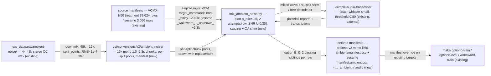

# Feature Spec: Ambient Babble Noise Overlay (VCM + Sesame Wakeword)

**Status:** approved
**Date:** 2026-09-27

This feature materializes a babble (people-talking) ambient-noise overlay into the two datasets the shipping models train on — the VCM treatment manifest and the sesame wakeword manifest. Every mixed clip is ASR-gated with `simple-audio-transcriber` before it enters a manifest, and every mix draws its SNR independently from a uniform distribution over [0, 30] dB. This replaces the current single-regime noise exposure (Option B's fixed ~30 dB `_noisy` rows plus ESC-50-only online noise) with dynamic, wide-SNR, speech-like interference — the "command spoken in a semi-noisy room" condition the models have never seen.

## Context

- **Objective:** Build a chunked ambient-noise corpus from `raw_datasets/ambient-noise/` (4 CC files, 48 kHz stereo, ~3h17m), probabilistically mix 0–2 ASR-gated noisy siblings per target row into the VCM (`optionb-v3-vcmx` treatment, ~14,013 eligible rows: 8,993 Option B `_clean` + 5,020 `vcm_balanced` real) and sesame wakeword (3,056 rows, ~2,802 eligible: `_wakeword_` 1,555 + `_unknown_` 1,247) datasets, and emit derived manifests the existing `optionb-train`/`optionb-eval`/`wakeword-train` targets consume via manifest override. Size: medium — 3 new Python modules, 1 orchestration script, 2 one-line dataset-loader edits, 2 derived manifests.
- **Role:** strict systems architect (PyTorch audio/ML stack).
- **User goal:** voice-command models robust to a user speaking a command in a room with background conversation (edge device, far mic), across the SNR range from faint chatter (20–30 dB) to noise at command level (0 dB).
- **Source:** conversation of 2026-09-27; design-grill decisions Q1–Q5 (see Approvals).

**Size judgment:** full-size diagrams for a medium feature — a new corpus, a cross-model mixer, an external ASR gate, and derived manifests touching the existing train path. The gate's placement is the feature's core; a minimal diagram would hide it.

**Out of scope:** sesame promotion plumbing (Makefile defaults, streaming config, doc status flips — separate follow-up); the "computer" wakeword instance; Option B `_noisy` rows (kept untouched as the faint ~30 dB anchor); the ESC-50 corpus and its online U[5, 25] range; `_silence_` rows; new noise collection; eval-protocol changes (the new manifest's eval number is the mixed-condition number; the clean baseline is the existing treatment manifest's already-reported numbers, same eval target).

**State now:** VCM training sees ESC-50 noise online at U[5, 25] dB plus Option B's fixed ~30 dB rows; no babble anywhere in any mixing pool. Sesame wakeword sees ESC-50 noise (p=0.35 offline subsets + online `--noise-root`); no babble.

**State after:** both datasets carry per-row ambient-babble siblings at independently drawn SNRs in [0, 30] dB, every one ASR-verified, with the realized SNR histogram and license block documented in a build summary; training/eval run on the derived manifests via existing targets.

## Diagrams

### Data flow

Where does the data go, from raw files to training?



### Sequence

Who calls whom, in what order?

```mermaid
sequenceDiagram
    participant S as scripts/ambient_noise.sh (new)
    participant C as build_corpus.py (new)
    participant M as mix_ambient_noise.py (new)
    participant A as simple-audio-transcriber (external)
    participant T as make optionb-train / wakeword-train (existing)

    S->>C: stage 0 — corpus: 4 raw wav → chunks + manifest + per-file content check
    C-->>S: self-check: counts, 16k mono s16, rms ≥ 1e-4, raw md5 unchanged
    S->>M: stage 1 — --stage mix: plan jobs, mix attempts 1+2, write staging + shim + free-decode dir + qa_plan.csv
    S->>A: stage 2 — qa --naming v1-pair --threshold 0.80 (VCM + sesame positives)
    S->>A: stage 2 — plain transcribe (sesame _unknown_ dir)
    A-->>S: reports/*.md + transcriptions
    S->>M: stage 3 — --stage finalize: option B keep/drop + negative trigger check → subsets + derived manifests + summary.md
    M-->>S: summary: pass rates, realized SNR histogram, clipping rate, license block
    S->>T: stage 4 — optionb-train + wakeword-train (parallel, 2 GPUs); stage 5 — eval new checkpoints + baselines on the same ambient manifests (accent_balance_fil50.sh pattern)
```

## RECAP

### E — Edges

| Edge | Behavior |
|---|---|
| Both attempts fail the ASR gate | Row ships with 0 ambient siblings; its clean row stays. Counted in the summary's pass-rate table. |
| Attempt 2's chunk equals attempt 1's (same file + window) | Re-drawn at plan time; the two jobs of one row always use distinct chunks. |
| Source clip longer than any chunk (Option B max 6.0 s vs chunks ≤ 2.3 s) | `apply_noise` loops the chunk to the clip's length (existing, unit-tested behavior). |
| Mixed waveform exceeds ±1.0 (expected in the 0–5 dB tail) | Clamped to ±1.0 (existing pattern, `mix_background_noise.py`); clipping rate per SNR band reported in the summary. |
| A mix's transcriber report is missing or stale | Treated as gate failure (drop), never silently passed — `accent_balance/qa.py`'s `missing_qa_report` precedent. |
| A `_unknown_` mix free-decodes as the wake word (sesame / sesames / sesame's, word-boundary) | Dropped as label-contradicting (data-correctness, same principle as the command side). |
| A candidate transcript contains ` - `, `/`, or `\` (unsafe in v1-pair filenames) | Plan fails loudly listing the rows. Expected zero (command literals); any occurrence is stop-and-report, never rewritten. |
| Row already `_noisy` (Option B ~30 dB), or in babble/silence bucket, or `_silence_` (sesame) | Not eligible; never mixed. |
| Re-run with same seed and same inputs | Byte-identical plan and mixes; staging dir cleared at start (ESC-50 F-2 precedent). |
| Source or chunk file missing/corrupt on disk | Loud `ManifestValidationError` naming the file; staging rolled back — no partial subset ever becomes final. |
| A raw file later determined to be CC-ND | Excluded via corpus allowlist and corpus rebuilt; an ND file must never enter the pool (mixing is a derivative work). |
| A base row's path is local to the base manifest's dir (fil50 base: 4,435 `audio_noisy/` vcm_balanced rows), or any derived row's file is missing | Finalize rebases every base-row path relative to the derived manifest's dir and verifies all derived paths resolve to existing files — loud failure naming the missing count + samples, before any audio promotion or manifest write (found 2026-09-27: the un-rebased paths crashed VCM training at epoch-0 val). |
| A split's chunk pool is smaller than its draw count (~5.6k train chunks vs ~11.4k train draws) | Draws are **with replacement** within the split's pool (a noise texture is not an identity — same posture as the existing online `Augmenter` pool); no chunk crosses into another split's pool. |

### C — Contracts

```python
# src/me2_voicegen/common/ambient_mix.py (new)
SNR_MIN_DB = 0.0   # pilot human gate 2026-09-27: [−5, 0) dB band dropped (see Approvals)
SNR_MAX_DB = 30.0
P_MIX_DEFAULT = 0.5
NUM_ATTEMPTS = 2
AMBIENT_SUFFIX = "_ambient"

@dataclass(frozen=True)
class Chunk:
    chunk_id: str        # filename stem, unique within the corpus
    path: Path           # 16 kHz mono PCM_16 wav under <corpus>/audio/
    split: str           # train | val | test — the chunk's assigned pool
    start_s: float
    duration: float

@dataclass(frozen=True)
class AmbientJob:
    model: str            # "vcm" | "wakeword"
    source_row: dict      # eligible base-manifest row (sorted order preserved)
    attempt: int          # 1 | 2
    chunk: Chunk
    snr_db: float         # uniform in [snr_min_db, snr_max_db], independent per attempt
    expected_text: str    # VCM: the row's transcript; sesame _wakeword_: "Sesame";
                          # sesame _unknown_: "" → free-decode gate

def load_chunk_pool(corpus_root: Path, split: str) -> list[Chunk]
    # manifest.csv rows where split == split; verifies each wav is 16k/mono/s16 on first load.

def plan_jobs(
    model: str,
    source_rows: list[dict],          # pre-filtered to eligible, sorted by (group_id, filename)
    pools: dict[str, list[Chunk]],    # per-split pools
    *, p_mix: float = P_MIX_DEFAULT,
    snr_min_db: float = SNR_MIN_DB,
    snr_max_db: float = SNR_MAX_DB,
    seed: int,
) -> list[AmbientJob]
    # Per row in order: rng.random() < p_mix selects it; selected rows get exactly two jobs
    # (attempt 1: chunk c1, snr1; attempt 2: chunk c2 != c1, snr2), chunk drawn from the row's
    # own split pool with replacement, all draws uniform and independent. Deterministic given
    # seed. No filesystem access.

def mix_one(job: AmbientJob, source_path: Path, out_path: Path) -> None
    # Probe-verify source (16k/mono/s16) and chunk; loop/trim chunk to source length;
    # AF.add_noise at job.snr_db; clamp ±1.0; write 16k mono PCM_16; probe-verify output.

def select_passing(jobs: list[AmbientJob], passed: dict[str, bool]) -> list[AmbientJob]
    # Per attempt, independently: an attempt is kept iff passed[job_key(job)] is True;
    # a row therefore ships with 0, 1, or 2 siblings (grill Q2 unified semantics —
    # "up to 2 different samples", every stored one gate-passed).
    # A missing entry in `passed` == gate failure (never passes).
```

Corpus manifest — `out/conversions/v2/ambient_noise/manifest.csv` (new):
`filename, source_file, split, start_s, duration, rms` — chunks 16 kHz mono `pcm_s16le` in `audio/`; `split` is a 70/20/10 assignment of chunks (seeded); `source_file` names one of the 4 raw files.

Derived manifests (new):
- VCM: `out/conversions/v2/optionb-v3-vcmx-fil50-ambient/manifest.csv` = treatment rows + surviving ambient rows. Base columns (13) + `noise_source_file, noise_chunk_id, snr_db` (base rows: `""`). Base = `out/conversions/v2/optionb-v3-vcmx-fil50/manifest.csv` (the manifest `option-d-fil50` was trained on — user decision 2026-09-27, see Approvals/Deviations). Ambient rows: `source_dataset` = `optionb_ambient` / `vcm_balanced_ambient` / `fil50_persona_ambient`, `bucket` = `target_commands`, `label`/`transcript`/`split`/`group_id` inherited from the source row, `path` = `audio/<file>` (audio under the manifest's own dir). Base rows' relative `path`s are **rebased** to resolve from the derived manifest's dir (the fil50 base's 4,435 `vcm_balanced` `audio_noisy/` rows are local to the base dir), and finalize verifies every derived row's path resolves to an existing file, failing loudly otherwise.
- Sesame: `out/conversions/v2/wakeword-sesame/manifest.ambient.csv` = base manifest (15 columns) + `noise_chunk_id`. Ambient rows: `source_dataset` = `<base>_ambient` (e.g. `cosyvoice_conversion_ambient`, `adversaries_tts_ambient`, `common_voice_negative_ambient`), populate existing `noise_source_file`/`snr_db`, `path` under `ambient/audio/`, `split` inherited.
- Filename convention (both models): `<group_slug>__<source_stem>__amb<attempt>-<chunk_stem>.wav` (the `mix_background_noise.dest_filename` pattern).
- `summary.md` per model: pass rates per attempt, realized SNR histogram (5 dB bins) per split, clipping rate per band, per-source-file chunk counts + babble-presence report, row counts, license block (CC, per-file attribution stub, ND-exclusion rule, checkpoint-note requirement — ESC-50 §7 precedent).

CLI (new): `me2_voicegen.dataset_tools.mix_ambient_noise`
`--model vcm|wakeword --stage mix|finalize --manifest <base.csv> --corpus-root <dir> --out-root <dir>`
`[--reports-dir <dir>] [--p-mix 0.5] [--snr-min-db 0] [--snr-max-db 30] --seed 0 [--dry-run] [--max-rows N]`
- `mix`: filter eligible rows → `plan_jobs` → mix every job (both attempts) into a cleared staging dir → write the v1-pair shim dir (symlinks `<expected text> - <rowid>-a<attempt>.wav`) for expected-text rows and the free-decode dir for `_unknown_` rows → write `qa_plan.csv` → stop. The transcriber runs externally in between (never imported or shelled out by this module — `accent_balance` precedent).
- `finalize`: parse reports (`build_sanitized_dataset.parse_report` + free-decode transcriptions, negative trigger check) → `select_passing` → write final audio (staged → atomic rename) → derived manifest → `summary.md`.

Orchestration (new): `scripts/ambient_noise.sh` — `STAGES="0 1 2 3 4 5"` (corpus / mix / transcribe / finalize / train / eval), a variant of `accent_balance_fil50.sh` (user decision 2026-09-27, see Approvals): `GPUS` required for stages 2–5 (stage 2 uses the first GPU; stage 4 trains VCM + wakeword in parallel on the first two; stage 5 evals sequentially on the first), `VCM_MINUTES`/`WAKEWORD_MINUTES` (defaults 90/30 — the original `option-d-fil50` / `wakeword-sesame` budgets), `SEED`, `FORCE`, `PILOT=<n>` (stages 0–3 only, on the first n eligible rows per model, then `pilot_report.md` + `listen/` dir organized by SNR band and STOP for human listening). Stage 5 = `optionb-eval` on the new checkpoint, `vcm.evaluate` of the existing `out/vcm/option-d-fil50` checkpoint and `wakeword.train --eval-only` of the existing `out/wakeword-sesame` checkpoint on the **same** derived manifests (same-test before/after), plus `wakeword-export`/`wakeword-bench` — the accent_balance salvage pattern.

Existing-code edits (the only two):
```python
# vcm/dataset.py __getitem__ and wakeword/dataset.py's equivalent (both at their
# augment_waveform call site): skip the online noise step for already-ambient rows
# so no row is double-noised (RIR + SpecAugment still apply):
is_ambient = row["source_dataset"].endswith(AMBIENT_SUFFIX)
noise_pool = None if is_ambient else (self._noise_pool() if self.augmenter.p_noise > 0 else None)
```

### A — Assumptions

| Assumption | Verified when / how |
|---|---|
| `~/simple-audio-transcriber` runs here with faster-whisper `small` (EN+TL) in its own uv env, CUDA available | stage 2 first invocation (1-file smoke); precedent: accent-balance stage 3 ran this pipeline 2026-09-25 |
| the transcriber repo has a plain-transcribe CLI usable for free-decoding the negative dir | checked during stage 2 dev; if absent → pause and ask (external-repo change) |
| the 4 raw files are CC and none is ND | user declaration 2026-09-27 ("all CC from YouTube"); ND check at attribution stub; ND → excluded per edge E11 |
| raw files are 48 kHz stereo s16 PCM, ~3h17m total | ffprobe-verified 2026-09-27 |
| chunking yields a large pool per split (~8,000 expected from 11,862 s of audio) | stage 0 self-check — **verified 2026-09-27**: 7,936 chunks; train 5,555 / val 1,587 / test 794 (draws are with replacement, so no exhaustion risk at these sizes) |
| all candidate transcripts are v1-pair-safe | plan-time check (edge E7) |
| `apply_noise` handles chunk shorter than clip | existing; `tests/test_vcm_augment.py` |
| ASR budget: ~23.1k clips (20,930 VCM + 2,218 sesame at p_mix=0.5, seed 0) ≈ 11–12 h of audio at faster-whisper small on one GPU ≈ 20–90 min (nominal ~45) | stage 2 wall clock; if > 2 h, stop and report |
| a GPU is available for stage 2 and any training smoke | operator supplies `GPUS` (accent-balance convention) |

### P — Proof

| # | Test / integration path / mock scenario | Command | Result |
|---|---|---|---|
| 1 | units: `plan_jobs` determinism (same seed → identical jobs), distinct chunks per row, realized p_mix ≈ 0.5 ± tol over 10k rows, SNR uniformity over 10k draws, `select_passing` option-B matrix (pass1 / fail1+pass2 / fail1+fail2 / missing report), v1-pair-unsafe transcript rejection, `mix_one` output format (16k mono s16, length preserved) + measured SNR within 1 dB of target | `uv run pytest tests/test_ambient_mix.py -v` | — |
| 2 | regression + new skip behavior: ambient rows pass through `VCMDataset`/`WakewordDataset` with the train augmenter WITHOUT the online noise step (waveform invariant under a forced `p_noise=1.0`), non-ambient rows still noised | `uv run pytest tests/test_vcm_dataset.py tests/test_wakeword_dataset.py -v` | — |
| 3 | corpus self-check: manifest rows == audio files, all 16k mono s16, rms ≥ 1e-4, per-split counts, raw/ md5 unchanged | `uv run --with soundfile --with numpy python out/conversions/v2/ambient_noise/build_corpus.py --check` | — |
| 4 | integration: 20-row fixture manifest + 8-chunk fake corpus + mock transcriber reports → derived manifest invariants (split inheritance, group-disjointness 0 violations, `_ambient` suffixes, provenance columns, realized histogram matches plan, 0/1/2-sibling cases all present, base-path rebasing + resolve-check loud failure) | `uv run pytest tests/test_mix_ambient_integration.py -v` | — |
| 5 | pilot: real corpus + real transcriber on `PILOT=50` rows per model → `pilot_report.md` + `listen/` dir (samples per SNR band) → human listens | `PILOT=50 GPUS=<n> bash scripts/ambient_noise.sh` | **pass 2026-09-27** (VCM 32/36 stored, sesame 36/36 stored; human gate approved with the SNR-range change) |
| 6 | full run: both models, seed 0, stages 0–5 | `GPUS="<g1> <g2>" SEED=0 bash scripts/ambient_noise.sh` | — |
| 7 | stage 4 train on the derived manifests (VCM `optiond` + sesame wakeword, parallel) | `scripts/ambient_noise.sh` stage 4 → `out/vcm/option-d-fil50-ambient/`, `out/wakeword-sesame-ambient/` | — |
| 8 | stage 5 eval: new checkpoints on the ambient manifests **and** the existing `option-d-fil50` / `wakeword-sesame` checkpoints on the same manifests (before/after) | `scripts/ambient_noise.sh` stage 5 → `*/baseline_old_ckpt/` reports + export/bench | — |
| 9 | gate suite | `make test` | — |

## Deviations

| Date | Deviation | Minor: rationale / Material: design-gate re-run |
|---|---|---|
| 2026-09-27 | `select_passing` contract comment said strict sequential retry (row capped at 1 sibling); corrected to independent per-attempt gating (0/1/2 siblings) | Minor: spec-text correction aligning the C section with the already-approved Q2 unification ("row ships with 0, 1, or 2 stored siblings", also in E1); no design change, user saw the corrected semantics at the spec gate |
| 2026-09-27 | "Existing-code edits (the only two)" missed `vcm/text.py:resolve_transcript`, which raised `ValueError` on the derived manifest's `optionb_ambient`/`vcm_balanced_ambient` rows — `VCMDataset` construction (and hence Proof #7's training smoke and any `optionb-eval` on the derived manifest) would crash. Fixed by stripping the `_ambient` suffix before dispatch (ambient rows carry the base transcript verbatim → base branch). Also verified while there: `vcm/evaluate.py`'s headline metrics (exact accuracy, per-intent confusion, false-accept) include ambient rows unchanged; its slot-accuracy and speaker-group diagnostics filter on exact `source_dataset == "optionb"` and so exclude ambient rows from those two diagnostics (consistent with "eval-protocol changes out of scope"); `wakeword/train.py`'s Filipino-row classifier handles ambient rows via the inherited `ref_voice` fallback (no change needed) | Minor: one-line behavior-preserving extension of an existing dispatch branch — no design change, no new values for any existing source_dataset, required for the approved design (derived manifests consumable by existing targets) to work at all |
| 2026-09-27 | VCM base manifest changed from the bare `optionb-v3-vcmx` to `optionb-v3-vcmx-fil50` (39,624 rows — the manifest `out/vcm/option-d-fil50` was trained on), per user decision so the ambient siblings land on the same population the shipping model saw, including the 9,958 clean `fil50_persona` rows (their 4,435 `_noisy` variants stay ineligible via the stem check). Derived out root renamed to `optionb-v3-vcmx-fil50-ambient` to keep lineage explicit; `fil50_persona_ambient` added to the ambient `source_dataset` values (C section). Supersedes the previous deviation's VCM eligible count: actual VCM eligible is now **20,842** (8,993 Option B `_clean` + 1,891 `vcm_balanced` `target_commands` + 9,958 `fil50_persona`), planned jobs at p_mix=0.5/seed 0 = 20,930 (dry-run verified); sesame unchanged at 2,290 / 2,218 | Minor: base + out-root rename on a user request; all eligibility rules (edge E) applied unchanged, `resolve_transcript`/dataset-loader already handle `fil50_persona_ambient` (the suffix-strip is base-agnostic); no design change |
| 2026-09-27 | The derived VCM manifest copied base rows' `path`s verbatim; the fil50 base's 4,435 `vcm_balanced` `_noisy` rows carry **local** paths (`audio_noisy/...`, resolvable only from the base dir), so the derived manifest (a sibling dir) did not resolve them and VCM stage-4 training crashed at epoch-0 val (`Failed to open the input .../optionb-v3-vcmx-fil50-ambient/audio_noisy/vcm_val_014764_noisy.wav`). Fix: `stage_finalize` now rebases every relative base-row path against the derived manifest's dir (`os.path.relpath(normpath(base_root / p), derived_root)` — pure string math, `../` rows normalize unchanged in the sibling layout) and verifies all derived paths resolve to existing files, raising before audio promotion/manifest write. Regression test added (Proof #4). Full-run re-finalized from existing staging + reports (no re-ASR); VCM training re-run | Minor: implements the already-stated contract that derived manifests are consumable by existing targets via manifest override (same convention as the base's own `../` rows); no design change; the missing-file check only makes finalize stricter, never more permissive |
| 2026-09-27 | Build-time findings against the real manifests: (a) Option B's `_noisy` rows signal noise via the **filename stem** (source_dataset stays `optionb`), so the C-section's "exclude `source_dataset` ending in `_noisy`" filter alone would have re-mixed all 8,993 VCM `_noisy` rows — `filter_eligible` now also excludes `_noisy` filename stems (wakeword's `_noisy` source_dataset subsets were already covered). Re-mixing noisy rows was also data-corrupting: `ambient_row` would have overwritten their existing ESC-50 `snr_db` provenance. (b) The Context line's eligible counts were raw label/source sums, not the edge-E-filtered counts: `vcm_balanced` is a balanced dataset — 5,020 rows = 1,891 `target_commands` + 2,497 `babble` + 632 `silence` — and edge E excludes the babble/silence buckets, so actual VCM eligible = 8,993 Option B `_clean` + 1,891 `vcm_balanced` = **10,884** (not 14,013); sesame actual eligible = 1,145 `_wakeword_` + 1,145 `_unknown_` = **2,290** (not ~2,802, which counted the 512 `_noisy`-subset rows edge E excludes) | Minor: implements the RECAP eligibility rule that was already approved (edge E + the "target_commands bucket, non-empty transcript" C-section contract + the Proof #4 ineligibility test); the Context line's tilde-counts just weren't reconciled against edge E. No design change, no code change beyond the `_noisy`-stem exclusion in (a) |
| 2026-09-28 | Reverb co-occurrence experiment layered on this feature (ticket `.scratch/ambient-reverb-cooccurrence/tickets/00-RECAP.md`): (a) a `--p-rir` flag added to `wakeword/train.py` (default `0.0` — every existing invocation byte-unchanged; the wakeword line previously had no RIR exposure at all); (b) two **comparison-only** checkpoints trained with elevated `--p-rir` into new out-dirs (`out/vcm/option-d-fil50-ambient-rir` at 0.7, `out/wakeword-sesame-ambient-rir` at 0.3 — all other flags identical to the shipped runs); (c) a new fixed-seed noisy/reverb eval gate `src/me2_voicegen/wakeword/noisy_eval.py` (wakeword port of iteration3's `vcm/noisy_eval.py`). **Pure addition, not a deviation**: nothing shipped changed — both `_ambient` derived manifests, the corpus, and the two shipped ambient checkpoints are byte-unchanged, and the shipped VCM run had already trained at the default `p_rir=0.3` (so the VCM side is a 0.3-vs-0.7 comparison). Result: null-to-negative — VCM's clean→noisy drop unchanged (−5.2/−5.4 pt, noisy silence FAR 0.003→0.019) and wakeword test recall fell 0.899→0.856 (confounded by epoch count under the shared wall-clock budget); full tables in the ticket's Execution Log + `docs/archive/PROCESS-WAKEWORD.md` (sesame section, 2026-09-28 entry), which also records a latent finding: the wakeword online ESC-50 noise pool has been silently empty in every training run (`--noise-root` points one level above the `audio/` dir; the non-recursive glob finds nothing) | Minor: additions only — no change to the approved design, the shipped data, or any shipped checkpoint; recorded here per the ticket's documentation requirement ("judge whether it counts as a deviation or a pure addition — document either way") |

## Approvals

| Date | Gate | What was approved / decided | By |
|---|---|---|---|
| 2026-09-27 | design-grill Q1 | scope: VCM + sesame wakeword, both; probabilistic mixing; up to 2 distinct-noise siblings per row; offline materialization (new data on disk) | user |
| 2026-09-27 | design-grill Q2 | gate = option B: two attempts, per-mix ASR check, only passing mixes stored, realized SNR histogram reported | user |
| 2026-09-27 | design-grill Q3 | wakeword: mix `_wakeword_` (v1-pair, expected "Sesame") + `_unknown_` (inverted trigger gate); `_silence_` left clean; sesame is the production wakeword going forward (promotion plumbing out of scope) | user |
| 2026-09-27 | design-grill Q4 | p_mix = 0.5 both models; uniform SNR draw over [−5, 30] per attempt; Option B ~30 dB rows untouched as anchor; online ESC-50 U[5, 25] continues on non-ambient rows only | user |
| 2026-09-27 | design-grill Q5 | corpus licensed as the existing encumbered audio is treated (ESC-50 precedent: isolation, license block, checkpoint note); all 4 files in the pool, content check report-only | user |
| 2026-09-27 | spec gate | full spec approved as written (context, diagrams, RECAP E/C/A/P); user asked one confirmation question (noise mechanism: offline materialization, not runtime overlay) and confirmed the spec answers it | user |
| 2026-09-27 | VCM base manifest | extend the dataset `option-d-fil50` was trained on (`optionb-v3-vcmx-fil50`, 39,624 rows) instead of the bare `optionb-v3-vcmx` base — so the ambient siblings land on the same population (incl. the 9,958 `fil50_persona` rows); derived out root renamed `optionb-v3-vcmx-fil50-ambient` to keep lineage explicit. Sesame base unchanged (`wakeword-sesame`) | user |
| 2026-09-27 | pilot human gate (Proof #5) | pilot reviewed (VCM 32/36 stored, sesame 36/36 stored; `out/ambient-noise-pilot50/pilot_report.md` + `listen/`); approved to proceed to the full run with one change — the SNR range: the [−5, 0) dB band is dropped ("too much noise, might skew the model"), SNR is now uniform over **[0, 30] dB** (`SNR_MIN_DB = 0.0`) | user |
| 2026-09-27 | train/eval steps | train + eval run as a variant of `scripts/accent_balance_fil50.sh` (script stages 4/5): parallel 2-GPU train on the derived manifests, then eval of the **new** checkpoints plus re-eval of the existing `out/vcm/option-d-fil50` and `out/wakeword-sesame` baselines on the same ambient manifests (same-test before/after salvage), with export/bench | user |
