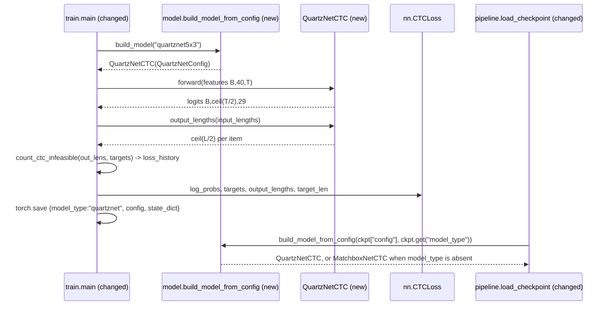

# Feature Spec: QuartzNet-5x3-tiny character-CTC student

**Status:** in-build
**Date:** 2026-09-30

Add a second VCM acoustic-model architecture, `QuartzNetCTC` (preset `quartznet5x3`), with the same 40-mel input, the same 29-symbol CTC output and the same parameter budget as production `optiond` (1,009,725 params). Train it once with the production recipe and compare it against the production checkpoint `out/vcm/option-d-fil50-ambient-rir-135m` on the existing clean + noisy gate. Its one structural change is total temporal stride 2: posteriors drop from T to ceil(T/2) frames, which should roughly halve the Python beam search that dominates per-window latency (~97%). This is a comparison experiment. Nothing is promoted, and the serving defaults do not change.

Task breakdown, run plan, and verified facts: `.scratch/quartznet-ctc/tickets/00-RECAP.md`. Research basis: `docs/research/ctc-edge-model-alternatives.md` (its baseline is superseded: compare against `optiond`, not `optionc`).

## Context

- **Objective:** a new model class plus a model factory keyed on checkpoint metadata, stride-aware CTC lengths in training, stride-aware ONNX export, a main-tree port of the noisy-eval gate, and an end-to-end CPU latency bench. **Size: medium.** It spans about 6 existing modules and adds 3 new ones. It crosses a trust boundary (checkpoint loading) and changes a silent-failure path (CTC lengths), so it gets both diagrams.
- **Role:** strict systems architect for a PyTorch CTC training/export pipeline.
- **User goal:** decide, from one fair same-recipe run, whether a strided QuartzNet student matches `optiond` accuracy and FAR at lower end-to-end latency.
- **Source:** user request 2026-09-30; research doc above; baseline report `out/vcm/option-d-fil50-ambient-rir-135m/noisy_eval/metadata/eval_report.md`.

## Diagrams

### Data flow

Where do features, lengths, and checkpoints go?

```mermaid
flowchart LR
    Manifest[fil50-ambient manifest.csv] -->|waveform, target_ids| Collate[VCMDataset + collate_fn]
    Collate -->|features B,40,T + input_lengths| Train[train.main (changed)]
    Train -->|preset| QN[QuartzNetCTC via model factory (new)]
    QN -->|logits B,ceil T/2,29 + output_lengths| Train
    Train -->|state_dict, config, model_type| Ckpt[checkpoint.pt]
    Ckpt -->|config + model_type| Load[load_checkpoint x2 (changed)]
    Load -->|model| Eval[evaluate + noisy_eval (ported)]
    Load -->|model| Export[export_onnx, time_out axis (changed)]
    Export -->|fp32/int8 .onnx| Bench[e2e_benchmark (new)]
```

### Sequence / component

How do output lengths reach CTCLoss, and how does a checkpoint find its class?



## RECAP

### E — Edges

| Edge | Behavior |
|---|---|
| Legacy checkpoint with no `model_type` key | Loads as `MatchboxNetCTC`. The state_dict and forward output are bit-identical to today. |
| `model_type` not in the closed registry | `ValueError` that names the allowed keys. No `importlib`, `getattr`, or pickle-based class resolution. |
| `config` keys that don't match the `model_type` dataclass | Dataclass `TypeError` propagates and fails loudly. No silent fallback to another class. |
| Odd input length T at stride 2 | Output length is `ceil(T/2)`. `output_lengths(L)` equals the forward T' for every L in 1..300 at strides 2 and 4. |
| Padded batch | Each item's `output_lengths[i] <= T'_padded`. CTC uses only the valid prefix. |
| CTC-infeasible item (`out_len < len(target) + adjacent repeats`) | Counted every epoch (train and val), `WARNING` printed, counts written to `loss_history.json`. `zero_infinity=True` remains, but its effect is no longer silent. On the real training manifest the count must be 0 at stride 2. |
| MatchboxNet run after this change | `output_lengths` is the identity, so `CTCLoss` receives exactly today's arguments. The existing `test_vcm_train.py` tests pass unchanged. |
| Strided ONNX export | The output time axis is named `time_out`, so it does not share the input's `time` symbol. The MatchboxNet export graph is unchanged and keeps `DEFAULT_DYNAMIC_AXES`. |
| `mean_frame` threshold (−0.1) at half the frames | Not portable. `evaluate` re-sweeps on clean val. A chosen threshold at a grid edge (0.0 or −5.0) fails the gate. |
| per_char −1.204 trial threshold; margin 4.0 | Not portable (raw beam mass changes with T). Neither is used in the gate; both are recorded as open follow-ups. |
| Preset INT8 ONNX > 1,048,576 bytes | Stop and report. Channel width changes only on a human decision. |
| `time_stride` not in {2, 4}; even kernel; kernel count ≠ `n_blocks` | `ValueError` at config construction. |
| `weights_only=True` load of a new checkpoint | Succeeds, because the checkpoint holds only tensors and plain str/int/float/list/bool. |
| e2e bench pointed at the production run dir | Reads `export/*.onnx` only and writes JSON to `--out` only. It never re-exports or overwrites the baseline. |

### C — Contracts

```python
# src/me2_voicegen/vcm/quartznet.py (new)
@dataclass
class QuartzNetConfig:
    n_mels: int = 40
    n_blocks: int = 5
    repeats: int = 3                      # separable sub-modules per block
    channels: int = 192                   # MEASURED; capped by the INT8-size gate, see Deviations
    kernel_sizes: list[int] = [7, 9, 11, 13, 15]   # odd; len == n_blocks
    prologue_kernel: int = 11             # depthwise, stride 2
    epilogue_kernel: int = 15
    epilogue_channels: int = 256
    time_stride: int = 2                  # {2, 4}; 4 = prologue s2 + block-1 first module s2
    dropout: float = 0.0
    alphabet_size: int = ALPHABET_SIZE

class QuartzNetCTC(nn.Module):
    total_stride: int
    def __init__(self, config: QuartzNetConfig | None = None) -> None: ...
    def forward(self, features: Tensor) -> Tensor: ...          # (B,40,T) -> (B,T',29)
    def output_lengths(self, input_lengths: Tensor) -> Tensor: ... # conv arithmetic, int64

# src/me2_voicegen/vcm/model.py (changed)
class CTCAcousticModel(Protocol):
    def forward(self, features: Tensor) -> Tensor: ...
    def output_lengths(self, input_lengths: Tensor) -> Tensor: ...
MatchboxNetCTC.output_lengths(input_lengths) -> Tensor        # identity (clone)
MODEL_TYPE_KEY = "model_type"; LEGACY_MODEL_TYPE = "matchboxnet"
ARCHITECTURES: dict[str, tuple[type, type[nn.Module]]]         # {"matchboxnet": ..., "quartznet": ...}
def model_type_for_config(config) -> str: ...
def build_model_from_config(config: dict, model_type: str | None = None) -> nn.Module: ...
PRESETS["quartznet5x3"] = QUARTZNET5X3_CONFIG; build_model(preset) -> nn.Module

# src/me2_voicegen/vcm/train.py (changed)
def ctc_min_frames(target_ids: list[int]) -> int: ...   # len + adjacent repeats
def count_ctc_infeasible(output_lengths: Tensor, target_ids: Tensor, target_len: Tensor) -> int: ...
def run_eval(model, loader, criterion, device, stats: dict | None = None) -> float  # stats["ctc_infeasible"]
# checkpoint.pt: {..existing keys.., "model_type": str}
# loss_history.json: {..existing.., "model_type", "total_stride", "ctc_infeasible_total_train",
#                     history[i]: {.., "ctc_infeasible_train", "ctc_infeasible_val"}}
# --preset choices == sorted(PRESETS)

# src/me2_voicegen/vcm/export_onnx.py (changed)
STRIDED_DYNAMIC_AXES = {"features": {0: "batch", 2: "time"}, "logits": {0: "batch", 1: "time_out"}}
# export_fp32 uses it iff getattr(model, "total_stride", 1) != 1 and dynamic_axes is None
# ONNX I/O names unchanged: "features" -> "logits"

# src/me2_voicegen/vcm/e2e_benchmark.py (new)
python -m me2_voicegen.vcm.e2e_benchmark --run-dir DIR --manifest CSV --split test \
  --n-clips 200 --window-s 2.5 --beam-width 50 --grammar optionb --seed 0 --out JSON
# JSON: {variant: {p50_ms, p95_ms, model_p50_ms, decode_p50_ms, t_out}, int8_fp32_intent_agreement, n_clips, hardware_label}

# src/me2_voicegen/vcm/noisy_eval.py (ported from me2-iteration3 @ b50541a)
# evaluate CLI gains: --noisy-eval-seed INT, --noisy-eval-rir-pool-size INT (default 200)
```

### A — Assumptions

| Assumption | Verified when / how |
|---|---|
| Recipe code has not changed since production commit `7c94abb` | Verified 2026-09-30: `git log 7c94abb..HEAD` over train/dataset/augment/features/model is empty. Re-check at run preflight. |
| The frame formula `floor(dur*16000/160)+1` equals `LogMelFeatureExtractor` T | Task 2 slow test, exact equality on 3 real clips, before the feasibility count relies on it. |
| No loss-bearing row in the training manifest is CTC-infeasible at stride 2 | Task 2 slow test on the real manifest: count == 0. Stride-4 count reported. |
| torch export fuses BN and emits only allow-listed ops | Task 3 op allow-list test on the exported preset. |
| The ported `noisy_eval` reproduces the recorded baseline | Task 4 parity run on the production checkpoint: 3448/3494 clean exact, 3345/3494 noisy exact, 10/255 noisy babble FA, threshold −0.1. |
| Channel width fits the budget | Task 1 measures it with `param_count`. The hand estimate (C=200 → ~0.98M) disagrees with an earlier 160–176 estimate, which is why it is measured. |
| Beam search dominates, so stride 2 roughly halves latency | Run plan R6: e2e p50 ratio reported (hypothesis ≤ 0.65). |

### P — Proof

| # | Test / integration path | Command | Result |
|---|---|---|---|
| 1 | `test_vcm_quartznet.py`: budget 900,000 ≤ params ≤ 1,009,725 (911,189 measured at C=192); forward (2,40,151)→(2,76,29); `output_lengths`==forward T' for L 1..300 at stride 2 and 4; config validation; factory round-trip, legacy default, unknown key | `uv run pytest tests/test_vcm_quartznet.py tests/test_vcm_model.py` | — |
| 2 | `test_vcm_train.py`: parser accepts `quartznet5x3`; `ctc_min_frames("hello")`==6; CTCLoss spy receives output lengths ≤ T'; real `train.main` 1 epoch writes `model_type` + infeasible counts; MatchboxNet args unchanged | `uv run pytest tests/test_vcm_train.py` | — |
| 3 | Real-data feasibility (slow): 0 infeasible rows at stride 2; frame formula == extractor | `uv run pytest -m slow tests/test_vcm_ctc_feasibility_real.py` | — |
| 4 | Loader/export: legacy + quartznet + unknown `model_type`; `weights_only=True`; FP32 parity max\|Δlogit\| ≤ 1e-4 at T∈{37,151,251}; `time_out` axis; op allow-list; INT8 runs at T=251; preset INT8 ≤ 1,048,576 B | `uv run pytest tests/test_vcm_pipeline.py tests/test_vcm_export.py tests/test_vcm_streaming_backends.py tests/test_vcm_e2e_benchmark.py` | — |
| 5 | Ported `test_vcm_noisy_eval.py`: bit-identical perturbations per (manifest, seed); threshold never re-swept on noisy val | `uv run pytest tests/test_vcm_noisy_eval.py` | — |
| 6 | Cross-cutting E2E via real entry points: `train.main` → `benchmark.main` → `vcm.streaming` file replay (`--backend onnx`) and `evaluate.main --noisy-eval-seed 0` | `uv run pytest tests/test_quartznet_ctc_e2e.py` | — |
| 7 | Acceptance gate G1–G9 (RECAP ticket), filled from run-plan artifacts | see ticket run plan | — |
| 8 | Full suite | `uv run pytest` | — |

## Deviations

| Date | Deviation | Minor: rationale / Material: design-gate re-run |
|---|---|---|
| 2026-09-30 | Width C=200 -> **192**. C=200: 978,053 params but INT8 ONNX 1,062,125 B > G4 (1,048,576). C=192: 911,189 params, 974,006 B (C=184: 909,979 B). | Material (RECAP Sizing/AC/Proof #1): user delegated implementation; change is one line and reversible, no GPU time spent. Flag at handoff. |
| 2026-09-30 | Real-data feasibility: 0 CTC-infeasible loss-bearing rows in train/val at stride 2; 1 in test (`cv-valid-train__sample-121890_c04.wav`, 0.59 s, needs 55 frames). Stride 4: train 15, val 1, test 1. | Minor: not filtered (scored, never trained on); slow test asserts train/val == 0, test <= 1. |
| 2026-09-30 | Smoke run GPU 7: 226 s/epoch vs optiond ~121 s (shared node) -> ~36 epochs in 135 min vs 67. | Minor: O-2 chose equal wall-clock; epochs reported. |

## Approvals

| Date | Gate | What was approved / decided | By |
|---|---|---|---|
