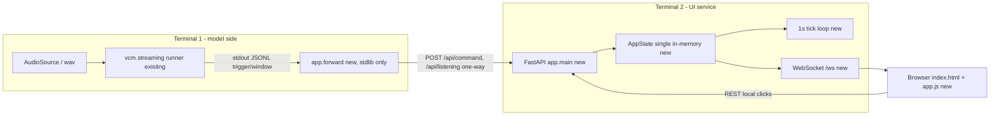

# UI site: a FastAPI dashboard as a separate service from the voice pipeline

**Status:** built (UI side); model-side follow-up parked (ticket below)
**Date:** 2026-09-29

## Context

- **Objective:** Turn the voice pipeline's decoded commands into a live smart-home
  dashboard: seven device panels (reminders, thermostat, lights, timer, alarm, music,
  phone) plus a listening indicator, per `src/app/services/requirements.md` (kept
  untouched; its `LightStateMachine` is the *pattern* every service mirrors, not
  literal code to reuse).
- **Role:** Separate FastAPI service (`src/app`) with a thin model-side forwarder
  (`src/app/forward.py`). The model→UI direction is one-way over the UI's HTTP API;
  the UI never calls, spawns, or reads the model, and makes no network calls at all
  (zero-cloud; weather is a stub behind a `WeatherProvider` seam).
- **User goal:** Two terminal windows — terminal 1 runs the streaming runner piped into
  the forwarder, terminal 2 runs `make app` — and a browser at
  http://127.0.0.1:8000 where voice commands and local clicks both move the same
  state, with the indicator showing passive (waiting for wakeword) vs. active
  (3-second semicircle, waiting for the command).
- **Source:** the requirements doc; a three-round design interview (grilling) whose
  answers this doc records verbatim as decisions; the repo's grammar contract
  (`docs/OPTIONB-GRAMMAR-CONTRACT.md`, 19 intents / 6 slots, 129 phrases), the
  streaming contract (`docs/STREAMING-CONTRACT.md` §5 JSONL schema), and a
  2026-09-29 double-check of `WakeWordGate`'s re-open behavior (see the parked
  ticket).

## Diagrams

### Data flow

Question: how does a spoken command reach a browser panel, and how does a local click
stay consistent with it?



### Sequence: one command

```mermaid
sequenceDiagram
    participant M as streaming runner (terminal 1)
    participant F as app.forward
    participant A as FastAPI app (terminal 2)
    participant S as AppState
    participant W as browser (WebSocket)

    M->>F: stdout JSONL {"event":"trigger","intent":"BRIGHTNESS","slots":{"PERCENT":"60 percent"},...}
    F->>A: POST /api/command {intent, slots}
    A->>S: dispatch.handle_command (validate intent/slot -> device action)
    S->>S: lights.set_brightness(60); indicator.on_command -> "Brightness 60 percent"
    A-->>F: 200 {ok, changed, detected, message, state}
    A->>W: broadcast(state.snapshot())
    Note over W: panel re-renders; detected line updates on every command
```

## Decisions (design interview, settled)

1. **Intake is decoded, not spoken.** `POST /api/command` takes
   `{"intent", "slots"}`; the UI imports `OPTIONB_GRAMMAR` from
   `me2_voicegen.vcm.optionb` (verified pure Python — no torch) purely as the
   intent/slot vocabulary (19 intents, 6 slot names, reminder-task choices), so UI
   and model share one source of truth and the UI never runs the grammar over text.
   `POST /api/listening` takes `{"state": "passive"|"active"}`.
2. **Architecture.** FastAPI app at `src/app` (`main.py`, `services/`, `state.py`,
   `dispatch.py`, `intents.py`, `weather.py`, `static/`). Packaged in the wheel
   (`packages = ["src/me2_voicegen", "src/app"]`) so `uv run` can import it —
   separate *service* by process, same venv. Vanilla single HTML page, no build
   step; REST + one WebSocket. Single global in-memory `AppState`; no persistence,
   no auth.
3. **Lights** (rescaled to the grammar's world): states OFF/20/60/100; INCREASE/
   DECREASE step 20→60→100 with caps; `POWER_ON` always lands on 20 (never
   resumes); `BRIGHTNESS` while OFF is ignored (strict validation). Color
   (red/green/blue from the grammar; white default/UI-only) is an orthogonal
   attribute, persists across power cycles.
4. **Thermostat:** discrete 18/22/26 only, default 22, full 3×3 set table.
5. **Output convention:** the indicator's detected-word line (and any UI logging)
   shows the **canonical intent label + slot value if present** — e.g.
   "Brightness 60 percent" — collapsing all three phrasings, never the raw spoken
   variant.
6. **Ignored-events policy (global):** every service is an explicit
   `(state, event) → next` table; an unmapped pair is *ignored* (no exception),
   REST still answers 200 with the unchanged state. A *malformed* command
   (unknown intent, missing required slot) is a 400 — different failure mode.
7. **Timer:** restricted to the grammar's 10 s / 30 s / 1 min; MM:SS countdown;
   at 00:00 "Timer done" + reset button, **no auto-reset**; re-issue while running
   is ignored (the user waits it out).
8. **Music:** state-only simulation (audio later — the seam is the panel's state):
   5 named tracks; play/pause/next (wraps)/stop (resets to track 1, a distinct
   "stopped" state); volume 0–100 default 50, ±10 steps with caps.
9. **Phone:** 8 hardcoded Filipino names + numbers; `CALL` picks a random person,
   enters an in-call state with an elapsed ticker; re-issuing `CALL` starts a new
   call (replace + restart ticker); hang-up is UI-only (no voice intent);
   `MESSAGE` picks a random person + random canned text into a visible,
   timestamped log (valid in any call state).
10. **Reminders:** task restricted to the grammar's three choices (voice *and*
    UI); timestamp = `HH:MM:SS` machine time when logged (voice: when spoken);
    append-only, no delete, no firing; the panel shows the latest only (or blank)
    until `LIST_REMINDERS` expands the full newest-first list; a collapse button
    re-collapses (UI-only).
11. **Alarm:** panel above the timer; reads "Alarm set for: HH:MM AM/PM"; times
    restricted to the grammar's 6 AM / 8 AM / 9 PM; replaceable by invocation
    from any state; lightweight due-check vs. current time.
12. **Indicator:** a pure receiver driven by the model's listening-state push
    (option A, not a local simulation); `passive` by default; a 3-second
    semicircle animates while `active`; the detected-word line updates on every
    command; the TIME/WEATHER read-out is a **temporary** status line — gone
    after 5 s, overridable by the next TIME/WEATHER.
13. **Forwarder:** thin stdlib-only HTTP client (no model imports): file mode
    (replay) + stdin mode (live pipe); pushes `trigger` → command, `listening` →
    listening, ignores `window`; instant by default, `--realtime` paces by
    `t_seconds`; any file path (the operator's trust boundary, same stance as
    `--source <wav>`).
14. **Deps/build/docs:** pinned `fastapi==0.115.6` + `uvicorn==0.30.6` (main) and
    `httpx==0.27.2` (dev, TestClient), with the README "Trimmed dependencies"
    table recording the reversal; `make app` serves at 127.0.0.1:8000; this SPEC
    + a README "UI site" section.

### Round-3 settlements

- **Alarm DUE:** once the current 12-hour hour+minute+AM/PM matches, the alarm
  goes DUE and **persists until the user resets or replaces it** (no auto-clear
  past the minute, no daily repeat). Replacing from DUE drops it back to SET.
- **Indicator while the model ticket is unbuilt:** the UI stays a pure receiver
  (passive by default); the forwarder **synthesizes** listening events in replay
  (`--synthesize-listening`: `active` at `t − 3 s`, `passive` at `t`) so the demo
  works end-to-end in replay. Live runs show passive until the ticket lands.
- **Model-facing work is parked**, not built here:
  `.scratch/ui-site/tickets/01-model-facing-gate-and-listening.md`
  (gate no-reopen-while-open + post-close refractory + `listening` JSONL events),
  to be interfaced later.
- **Docs:** this SPEC + the README section (above).

## Device state machines (as implemented)

| Device | States | Events (mapped → transition) | Ignored (no entry) |
|---|---|---|---|
| Lights | OFF, ON_20, ON_60, ON_100 | POWER_ON (OFF→20); POWER_OFF (any on→OFF); INCREASE (20→60→100, cap); DECREASE (100→60→20, cap); SET_20/60/100 (any on→target) | any SET while OFF; POWER_ON while on |
| Music | STOPPED, PLAYING, PAUSED | PLAY (STOPPED/PAUSED→PLAYING); PAUSE (PLAYING→PAUSED); NEXT (PLAYING/PAUSED→same, track+1 mod 5); STOP (any→STOPPED, track 1) | PLAY while playing; PAUSE while paused/stopped; NEXT while stopped |
| Phone | IDLE, IN_CALL | CALL (IDLE/IN_CALL→IN_CALL, new person, ticker 0); HANG_UP (IN_CALL→IDLE) | HANG_UP while idle. `MESSAGE` is an orthogonal log action (any state) |
| Reminders | collapsed/expanded panel flag | ADD (any; grammar task only, stamped HH:MM:SS); EXPAND; COLLAPSE | unknown task |
| Thermostat | T18, T22, T26 | SET_18/22/26 (any→target, full table) | any value outside 18/22/26 |
| Timer | IDLE, RUNNING, DONE | START_10/30/60 (IDLE/DONE→RUNNING); RESET (RUNNING/DONE→IDLE); tick (RUNNING→countdown, 0→DONE, stays DONE) | any START while RUNNING; RESET while IDLE |
| Alarm | UNSET, SET, DUE | set(time) (any→SET, replace); RESET (SET/DUE→UNSET); tick (SET→DUE on matching 12-hour HH:00 AM/PM; DUE persists) | time outside 6 AM/8 AM/9 PM; RESET while UNSET |
| Indicator | listening: passive/active (binary); detected line; status line (5 s TTL) | set_listening (push); on_command (detected line, every command); set_status (TIME/WEATHER); tick (status TTL) | unknown listening state |

Orthogonal attributes (not in the tables): lights `color`; music `volume`;
phone `messages`; alarm's set time; timer's duration.

## Intent → action map (all 19 grammar intents)

| Intent | Slot | Action |
|---|---|---|
| PLAY_MUSIC | — | music.play() |
| PAUSE | — | music.pause() |
| STOP | — | music.stop() |
| NEXT | — | music.next_track() |
| VOLUME_UP / VOLUME_DOWN | — | music.volume_up()/volume_down() (±10, caps) |
| LIGHT_ON / LIGHT_OFF | — | lights POWER_ON / POWER_OFF |
| BRIGHTNESS | PERCENT (20/60/100 percent) | lights.set_brightness(n) |
| COLOR | COLOR (red/green/blue) | lights.set_color(c) |
| TEMPERATURE | DEGREES (18/22/26 degrees) | thermostat.set(n) |
| TIME | — | indicator status "Current time is HH:MM" (5 s) |
| WEATHER | — | indicator status "Weather is <stub>" (5 s) |
| TIMER | DURATION (10 s/30 s/1 min) | timer.start(10/30/60) |
| ALARM | ALARM_TIME (6 AM/8 AM/9 PM) | alarm.set(t) |
| CALL | — | phone.call() |
| MESSAGE | — | phone.message() |
| CREATE_REMINDER | TASK (drink water/study/exercise) | reminders.add(task) |
| LIST_REMINDERS | — | reminders.expand() |

Every processed command also sets the indicator's detected line
(`format_detected`: canonical label + canonical slot value).

## API surface

- `GET /` (dashboard), `GET /static/*`, `WS /ws` (initial snapshot + push per
  change and per 1 s tick).
- Model-facing intake: `POST /api/command {intent, slots}` (400 on unknown
  intent / missing required slot; 200 + unchanged state on an ignored
  transition); `POST /api/listening {state}` (400 on unknown state).
- Local clicks: `POST /api/light/{power_on,power_off,increase,decrease}`,
  `POST /api/light/set_color {color}`, `POST /api/light/set_brightness {level}`,
  `POST /api/music/{play,pause,next,stop,volume_up,volume_down}`,
  `POST /api/phone/{call,hang_up,message}`, `POST /api/reminders {task}`,
  `POST /api/reminders/{expand,collapse}`, `POST /api/thermostat {degrees}`,
  `POST /api/timer/start {duration_s}`, `POST /api/timer/reset`,
  `POST /api/alarm/set {time}`, `POST /api/alarm/reset`.
- Read models: `GET /api/state` (full board snapshot), `GET /api/vocab`
  (closed choice lists for the UI: reminder tasks, alarm times, timer presets,
  light colors/levels, thermostat degrees, tracks).

All mutation responses are `{changed, message, state}` where `state` is the full
snapshot — the browser can render from either the response or the next WS push.

## JSONL replay behavior (forwarder)

- Parsed line → `trigger` ⇒ one `POST /api/command` with the record's
  `intent`/`slots` (null slots → `{}`); `listening` ⇒ one `POST /api/listening`;
  `window` / malformed lines ⇒ ignored.
- Instant (default): POSTs in file order, no pacing — fast, deterministic, for
  tests.
- `--realtime`: paces by `t_seconds` relative to the first forwarded event.
- `--synthesize-listening` (file mode only): around each trigger at time `t`,
  adds `active` at `t − 3 s` and `passive` at `t` (the gate's 3-second window),
  so the indicator's passive→active→passive cycle and 3-second semicircle are
  visible before the model-side ticket lands. Live mode never synthesizes.
- A failed POST is logged to stderr and the forwarder keeps going; the CLI exits
  1 if any replay POST failed.

## Testing

`tests/test_app_*.py` (12 files, 122 tests, all fast / no GPU / no weights / no
network): vocabulary guards against the grammar; per-service transition tables
including an exhaustive "every unmapped (state, event) pair is ignored" sweep;
clock-injected alarm/tick behavior; seeded-RNG phone determinism; dispatch for
all 19 intents; the full API surface via `TestClient` (including 400/422 paths
and the WS initial snapshot); forwarder parsing/mapping/synthesis/replay-plan. Caveat: `TestClient`
exercises the ASGI WebSocket interface in-process, so it does **not** cover
the uvicorn-level transport — that needs the `websockets` package installed
(see Dependencies above) and was verified manually against a running server.

## Dependencies / build

- `fastapi==0.115.6`, `uvicorn==0.30.6`, `websockets==12.0` (main — plain
  uvicorn ships no WebSocket protocol implementation; 12.0 is the major that
  still provides the legacy API uvicorn 0.30.x drives); `httpx==0.27.2`
  (dev, TestClient). Documented reversal in the README "Trimmed dependencies"
  table.
- `src/app` added to the wheel packages (importable via `uv run`; the voice
  pipeline never imports it).
- `make app` → `uvicorn app.main:app --host 127.0.0.1 --port 8000`.

## Non-goals

- No real audio playback, no smart-home hardware, no persistence, no auth, no
  multi-user, no network egress (weather stays a stub), no retraining, no PR.
- No model-side changes — the gate fix, refractory period, and `listening`
  JSONL events are the parked ticket, interfaced later.

## Parked model-side work

`.scratch/ui-site/tickets/01-model-facing-gate-and-listening.md` — Item A (gate
re-open control: A1 no-reopen-while-open [double-checked: NOT implemented
today; the opposite is pinned by a test], A2 post-close refractory
`IDLE→OPEN→REFRACTORY→IDLE` with binary listening projection unchanged, A3
SpacebarGate untouched) and Item B (`listening` events on stdout JSONL via the
existing `on_period_event` channel). The UI already consumes both: the forwarder
forwards `listening` records, and `--synthesize-listening` stands in for them
in replay.
